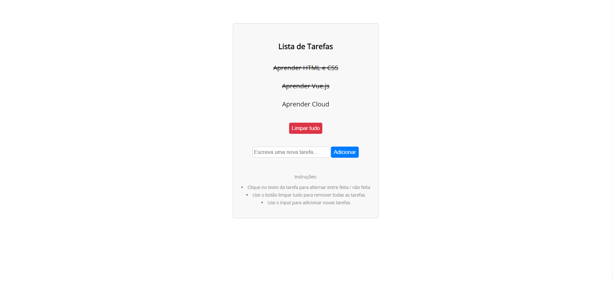

# Simple ToDo List em Vue.js

- Implementação simples de *Lista Tarefas* para estudo de Vue.js com Javascript
- Vue inserido no projeto pelo CDN
- Foco em treinar LocalStorage e diretivas de Vue.

## Descrição

- É mostrada a lista com as tarefas adicionadas.
- Não é permitido adicionar tarefa sem texto.
- Ao clicar na tarefa ela é marcada como pronta ou não.
- Sempre que há alguma alteração na lista, o objeto é atualizado no Local Storage também.
- Segue abaixo screenshots das views:

 

 

